# EW Chatbot Docs

Emergent Works uses a chatbot to track attendance for their virtual mentorship programs. This documents the setup and basic troubleshooting steps for the chatbot. Most of the setup is based on [this article](https://www.twilio.com/blog/2017/12/build-a-santa-bot.html) about creating a chatbot using a Zapier/Twilio integration with the responses tracked in a Google Sheet.

For the most part, the chatbot should be ready to go -- all we need to do is switch it on when the cohorts start -- but this step-by-step guide should help if you want to understand what's going on at each step. The basic workflow is as follows:

1. Zapier pings Twilio once a week at a specific time with a list of phone numbers to text.
2. Twilio sends out texts to check in with participants about their attendance.
3. Twilio pings Zapier again after a user submits their answers, and Zapier sends the answers to a Google Sheet.
4. Answers from the chatbot are recorded in the Google sheet.

If you want to set up a new chatbot, it should be fairly easy to duplicate (both Twilio and Zapier have the option to "clone" workflows).

## Table of Contents
- [Services Used](#services-used)
- [Integration Flow](#integration-flow)
    - [Part 1: Zapier Setup for Chatbot Trigger](#part-1-zapier-setup-for-chatbot-trigger)
    - [Part 2: Twilio Setup](#part-2-twilio-setup)
    - [Part 3: Zapier Setup for Google Sheet Records](part-3-zapier-setup-for-google-sheet-records)
    - [Part 4: Google Sheet Setup](#part-4-google-sheet-setup)
- [Where to Find Twilio Credentials](#where-to-find-twilio-credentials)
- [Where to Add Zapier Webhook Links in Twilio](#where-to-add-zapier-webhook-links-in-twilio)
- [How to Grant Zapier Access to Google Sheets](#how-to-grant-zapier-access-to-google-sheets)

## Services Used
- [Zapier](https://zapier.com)
- [Twilio](https://www.twilio.com/)
- [Google Spreadsheets](https://www.google.com/sheets/about/)

## Integration flow

## Part 1: Zapier Setup for Chatbot Trigger
The first part of the chatbot setup starts with setting up a flow in Zapier that will trigger the chatbot from Twilio. Zapier queues up a list of phone numbers, then pings the Twilio service to send out the attendance questions to the list of phone numbers. 

1. Log in to Zapier and go to the "Zaps" tab. Each program has a separate trigger for their own attendance Twilio chatbot. For this doc, the web development mentorship will be used as an example. The triggers are usually named "[Program]: Trigger Chatbot to Cohort".


2. Clicking on the Zap name will bring you to the Zap's setup.

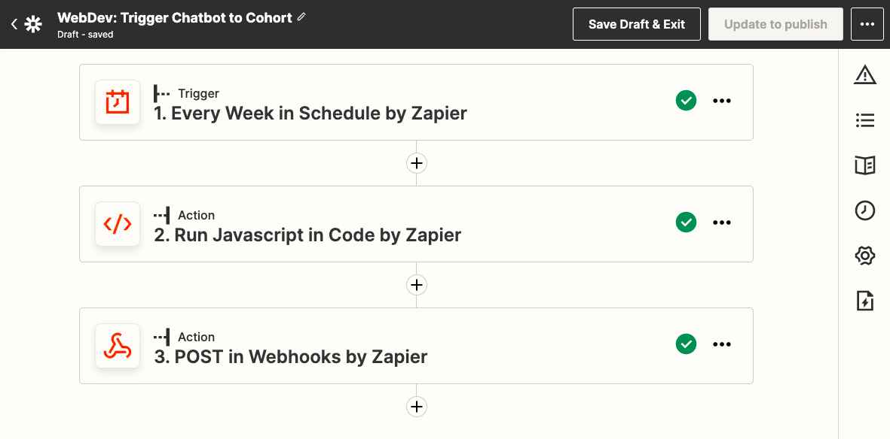

3. Each Zap is initialized with a "Trigger". Setting up the Trigger entails three steps.<br> 
  i. Under the "Choose App & Event" header, set the the App & Event as "Schedule by Zapier" and "Every Week".<br>
  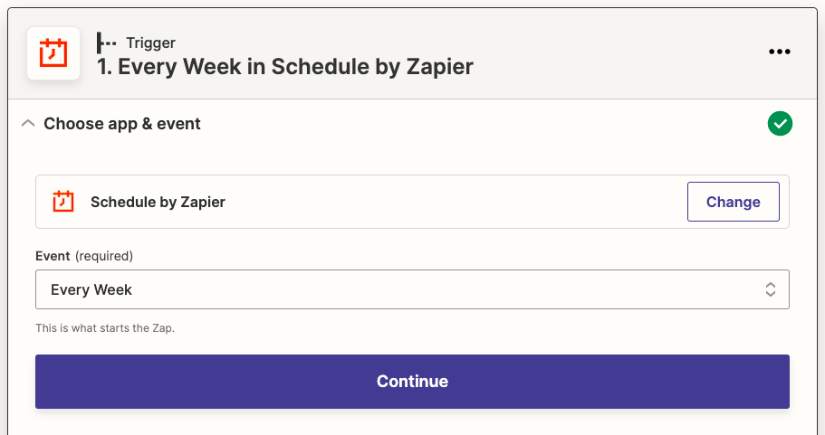
  
  ii. Under the "Set up trigger" header, set the Day of the Week and Time of Day to trigger the chatbot. Currently this is set as Monday at 8pm.<br>
  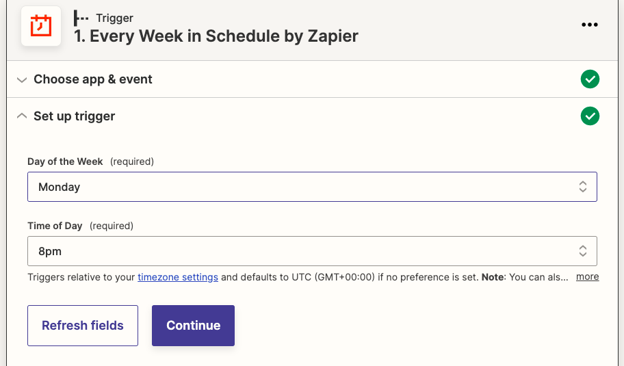

  iii. Test the trigger to ensure the fields are correctly filled out.<br>
  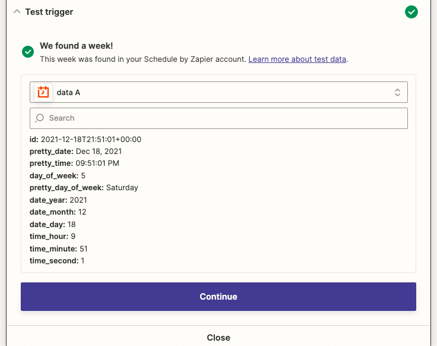

4. The next step in setting up the chatbot trigger is configuring an Action. This particular Action queues up the list of phone numbers from the cohort to communicate with the Twilio attendance chatbot. Setting up this Action also has three steps.<br>
  i. Under the "Choose App & Event" header, set the the App & Event as "Code by Zapier" and "Run JavaScript".<br>
  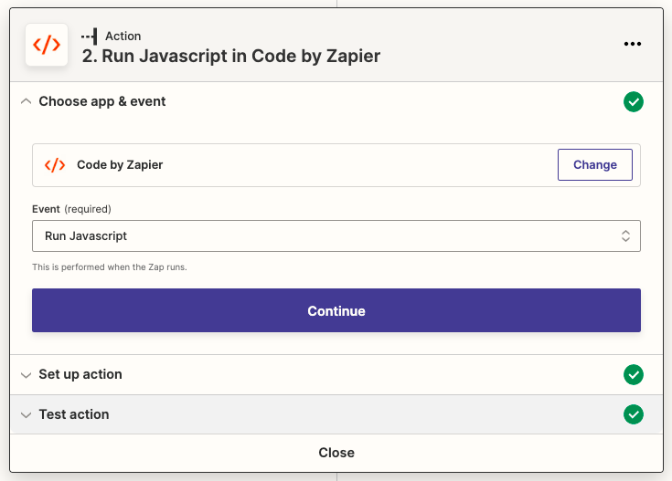

  ii. Under the "Set up action" header, add an array of phone numbers from members of the mentorship cohort in the Code section. This should be formatted the following way:<br>
  ````
  output = [
      { name: "John Doe", phone: "+15555553575"},
      { name: "Jane Doe", phone: "+15555554312"},
      { name: "Dane Joe", phone: "+15555551234"}
  ]
  ````
  Make sure you name the array `output = []` and each user's name should be wrapped in quotation marks. The phone number should be wrapped in quotation marks and start with +1 followed by the phone number without any spaces or dashes. Put a comma between each name/phone number pair.<br>

  You do not need to add anything to the Input Data fields.<br>
  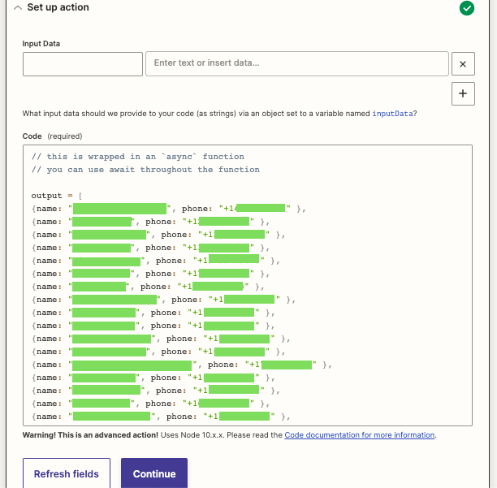

  iii. Test the trigger to ensure the fields are correctly filled out.<br>
  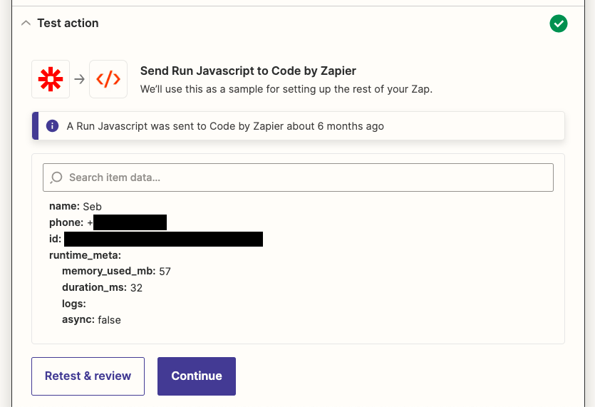

5. The last step for setting up the chatbot trigger is configuring another Action. This Action sends a request to the Twilio chatbot to start sending out the chatbot attendance questions. It requires authentication, so you'll need the unique execution URL and token from Twilio. Directions on where to find Twilio credentials are [here](#where-to-find-twilio-credentials).  Setting up this Action also has three steps.<br>
  i. Under the "Choose App & Event" header, set the the App & Event as "Webhooks by Zapier" and "POST".<br>
  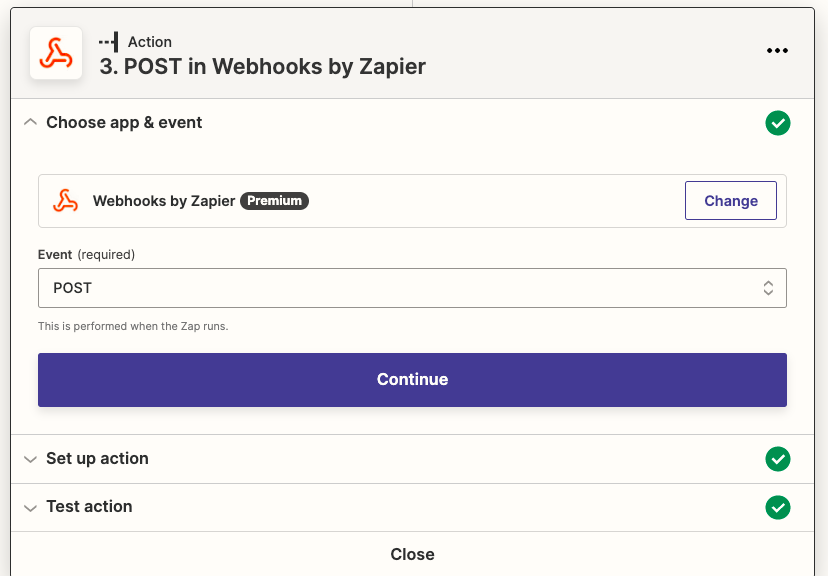

  ii. Under the "Set up action" header, fill out the following fields:<br>
      - URL: use the Twilio execution URL<br>
      - Payload Type: form<br>
      - Data<br>
        - For the To field: expand the "Run JavaScript in Code by Zapier" and select "Phone"<br>
        - For the From field: use the Twilio chatbot phone number<br>
      - Wrap Request in Array: No<br>
      - Unflatten: Yes<br>
      - Basic Auth: use the Basic Auth key from Twilio<br>
 
 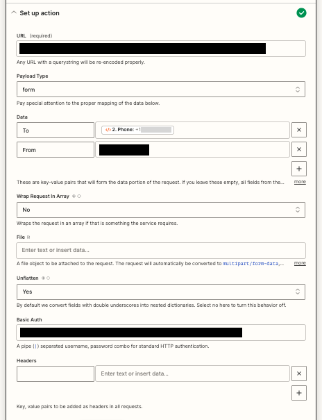

  iii. Test the trigger to ensure the fields are correctly filled out and Twilio can be authenticated.<br>
 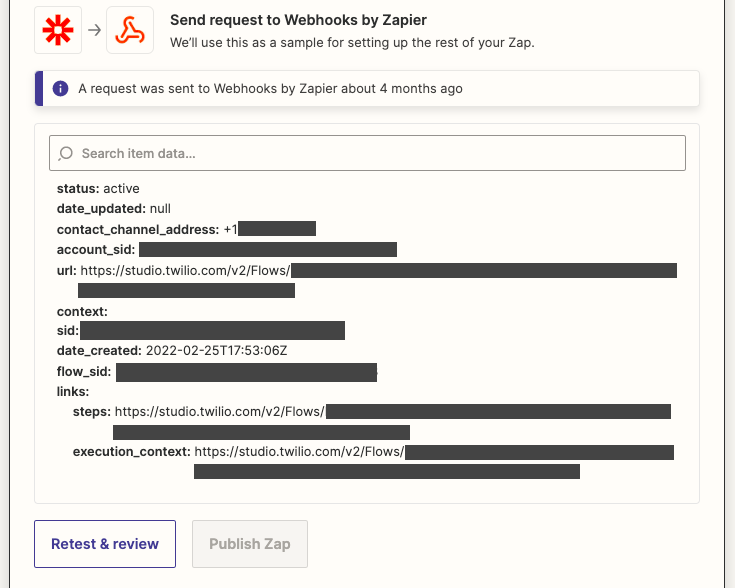

 ** MAKE SURE THE ZAP IS TURNED ON ONCE YOU'RE READY TO START THE CHATBOT **

## Part 2: Twilio Setup
Twilio is the service that manages sending texts to the cohort once Zapier sends the signal to Twilio to start the chatbot. This section will cover the basics of setting up the chatbot flow in Twilio, but most of the details are covered [here](https://www.twilio.com/blog/2017/12/build-a-santa-bot.html). Additional how-to docs for creating new flows can be found on the Twilio website [here](https://www.twilio.com/docs/studio/user-guide/get-started#create-a-flow). Most of this should already be set up, or there should be an option to clone a Twilio flow if you'd like to add a new one, so you shouldn't have to start from scratch or modify the current chatbots at all. 

If you're setting up a new chatbot, be aware that each chatbot needs its own designated phone number. Instructions for adding a new phone number to Twilio can be found (here)[].

1. Log in to the Twilio dashboard and click on the Studio Flows section.
2. Click on the Flow you want to edit or modify. Most flows are labeled as [**insert here**]

2. Creating a question
3. Sending the answers back to Zapier

## Part 3: Zapier Setup for Google Sheet Records
After the mentees and mentors have texted with the chatbot, their responses are recorded in a Google Sheet. This Zap is triggered by Twilio: once a user submits all their answers to the chatbot, Twilio will ping Zapier with the feedback to post the responses to the Google sheet. This section covers how the Zapier <> Google Sheet integration works, so the responses are appropriately recorded.

1. Log in to Zapier and go to the "Zaps" tab. Each program has a separate zap for adding the chatbot responses to a Google sheet. The Google sheet response zaps are usually named "[Program]: Add Feedback to Google Sheet".
2. Clicking on the zap name will bring you to the zap's setup.
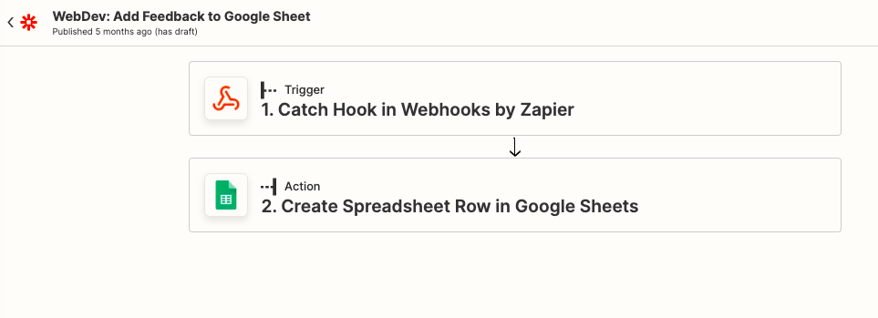

3. Similarly to the chatbot trigger zap, the Google sheet zap is initialized with a "Trigger". This trigger will be hooked into when Twilio sends the chatbot responses back to Zapier. Setting up the Trigger entails three steps.<br> 
  i. Under the "Choose App & Event" header, set the the App & Event as "Webhooks by Zapier" and "Catch Hook".<br>
  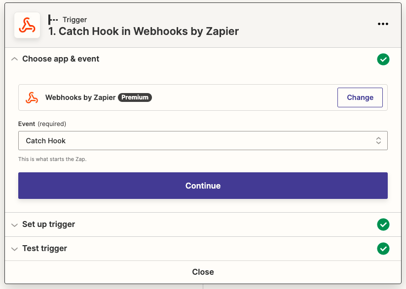

  ii. Under the "Set up trigger" header, you don't need to fill anything out (the trigger will come from Twilio). You will need to add the Zapier webhook URL to the Twilio chatbot, so Twilio knows which URL to send the responses to. Instructions for how to do this can be found [here](#where-to-add-zapier-webhook-links-in-twilio).<br>
  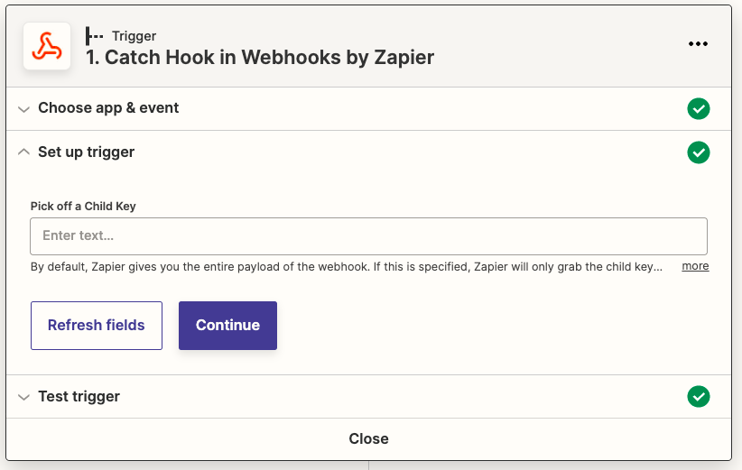

  iii. Test the trigger to ensure the fields are correctly filled out.<br>
  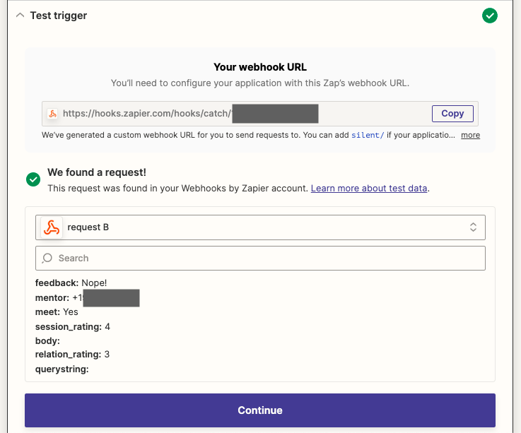

4. Next, there is a action to send the responses to the Google sheet. Setting up the action entails three steps:
  i. Under the "Choose App & Event" header, set the the App & Event as "Google Sheets" and "Create a spreadsheet row".<br>
  ii. Under "Choose account", select the Google account you want to authorize that has access to the attendance spreadsheet. Instructions for how to do this can be found [here](#how-to-grant-zapier-access-to-google-sheets).<br>
  iii. Under "Set up action" fill out the form as follows:<br>
      - Drive: can be blank<br>
      - Spreadsheet: select the correct attendance spreadsheet for the cohort<br>
      - Worksheet: since there are multiple tabs in most attendance spreadsheets, you'll want to select or create a tab in the spreadsheet that's labeled "Twilio_data"<br>
      - Selecting the spreadsheet will create a form pre-populated a list of columns from the spreadsheet. Match the data with the corresponding column<br>
          - Mentor: Mentor<br>
          - Attended: Meet<br>
          - How_was_it: Session Rating<br>
          - Relationship: Relation Rating<br>
          - Feedback: Feedback<br>
  iv. Test the trigger to ensure the new row is added to the Google spreadsheet.<br>

** MAKE SURE THE ZAP IS TURNED ON ONCE YOU'RE READY TO START THE CHATBOT **

## Part 4: Google Sheet Setup
The Google sheet for attendance is usually copied from previous cohorts, so there should be minimal setup needed for new cohorts. You can duplicate the Google sheet if you want a fresh copy, or you can add new tabs to the existing spreadsheet. Whether you decide to create a new sheet or use the existing sheet, there will need to be 3 main tabs:

1. The Attendance tab: this tab will have a list of the mentor/mentee pairs with the start/end date of the pairing and a list of weeks where attendance is tracked.
2. The Twilio_data tab: this tab will be the tab that's populated with the feedback from the chatbot each week. 
- to get the "Name" column to populate, you'll need to copy/paste this formula into the cell for each row that has feedback data: `=VLOOKUP(INDIRECT("A" & ROW()),Names!$A$1:$B$100,2, FALSE)`. This looks up each mentor/mentee's name in the Names tab to pull in the right label. I'm not an excel whiz, so there might be a way to figure out how to apply this formula to the whole column, but I haven't been able to figure out how to do that. 
- another nice-to-have for this spreadsheet would be figure out how to add a "Date Added" or "Date Modified" column, so we could see when the response came back from the chatbot. Right now it just keeps adding rows to the chatbot, so you sort of have to guess when the new entries start for each week.
3. The Names tab: this is the tab the Twilio_data tab will reference when listing the names of the mentors/mentees. In column A, add the phone number of a mentor/mentee in the format `+15551234567`. Be sure there is a +1 followed by the phone number without any spaces. In the next column, write the mentor/mentee's name. The Twilio_data sheet will look up the phone number and use the matching name for the entries that are added.

When you're working with the chatbot, the Twilio_data and the Names tab will be the ones you work with the most often. After the chatbot responses are added to the Twilio_data tab, another programs person will manually update the attendace list. Again, there's probably a way to automatically update the attendance sheet, too, but I'm not an excel expert & I'm not sure how to create a formula that would help the team skip the manual entry part.

## Where to Find Twilio Credentials
There are various credentials from Twilio that need to be added to the Zapier setup in [step 5 part ii](#part-1-zapier-setup-for-chatbot-trigger) of the Zapier set up for triggering the Twilio chatbot. This allows for a secure connection between the two services. Here is a list of the credentials you will need and where to find them. 

## Where to Add Zapier Webhook Links in Twilio
When you're working on [step #3 part ii](#part-3-zapier-setup-for-google-sheet-records) in the Zapier setup for Google sheets, you'll need to add a webhook URL to the Twilio setup so Twilio knows where to send the responses from the chatbot. When you click on the "Test Action" section, a box should come up with the label "Your Webhook URL."

1. Copy the link from the URL field. It should looks like https://hooks.zapier.com/hooks/catch/12345
2. Log in to Twilio and navigate to the chatbot flow you need to connect to Zapier
3. 

## How to Grant Zapier Access to Google Sheets
When you're working on [step #4 part ii](#part-3-zapier-setup-for-google-sheet-records) in the Zapier setup for Google sheets, you'll need to grant access for Zapier to read/write to Google sheets. This should already be set up, but if you're creating a new zap, you should be able to add access to Google sheets using these steps:

1. From the home page dashboard, go to the "My Apps" option on the navigation.
2. Click on "Google Sheets" or search for Google Sheets in the search box if it's not already listed.
3. When the Google sheets detail page comes up, click "+Add Connection".
4. A new browser window will pop up, prompting you to select a gmail account to use for the connection.
5. Click on the email that has the Google sheets you'll want to access.
6. Agree to allow Zapier to access your Google drive.