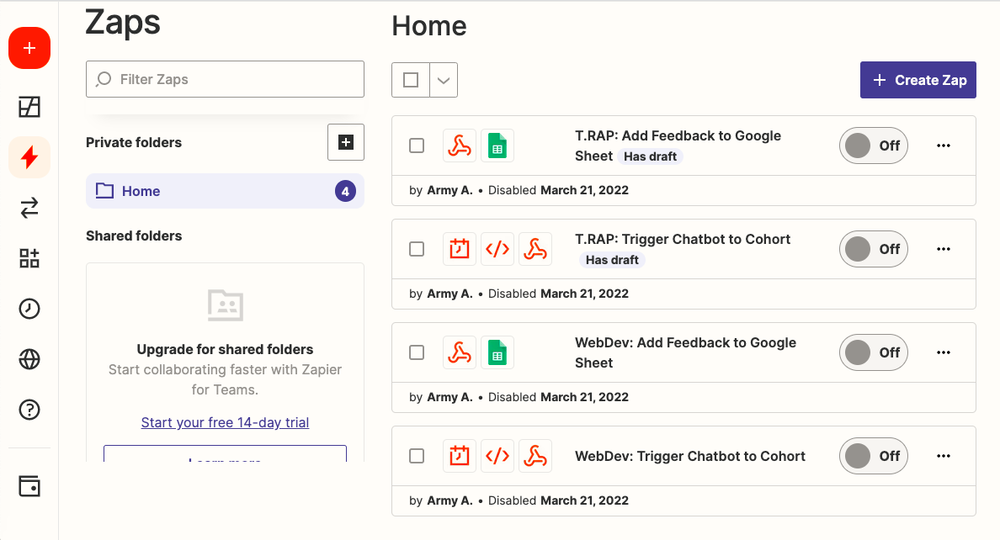

# EW Chatbot Docs

Emergent Works uses a chatbot to track attendance for their virtual mentorship programs. This documents the setup and basic troubleshooting steps for the chatbot. Most of the setup is based on [this article](https://www.twilio.com/blog/2017/12/build-a-santa-bot.html) about creating a chatbot using Zapier/Twilio integration with the responses tracked in a Google Sheet.

## Table of Contents (tk)

## Services Used
- Zapier
- Twilio
- Google Spreadsheets

## Integration flow

## Part 1: Zapier Setup for Chatbot Trigger
The first part of the chatbot setup starts with setting up a flow in Zapier that will trigger the chatbot from Twilio. Zapier queues up a list of phone numbers, then pings the Twilio service to send out the attendance questions to the list of phone numbers. 

1. Log in to Zapier and go to the "Zaps" tab. Each program has a separate trigger for their own attendance Twilio chatbot. For this doc, the web development mentorship will be used as an example. The triggers are usually named "[Program]: Trigger Chatbot to Cohort".



2. Clicking on the Zap name will bring you to the Zap's setup.


3. Each Zap is initialized with a "Trigger". Setting up the Trigger entails three steps.<br> 
  i. Under the "Choose App & Event" header, set the the App & Event as "Schedule by Zapier" and "Every Week".<br>
  
  
  ii. Under the "Set up trigger" header, set the Day of the Week and Time of Day to trigger the chatbot. Currently this is set as Monday at 8pm.<br>
  

  iii. Test the trigger to ensure the fields are correctly filled out.<br>
  

4. The next step in setting up the chatbot trigger is configuring an Action. This particular Action queues up the list of phone numbers from the cohort to communicate with the Twilio attendance chatbot. Setting up this Action also has three steps.<br>
  i. Under the "Choose App & Event" header, set the the App & Event as "Code by Zapier" and "Run JavaScript".<br>
  

  ii. Under the "Set up action" header, add an array of phone numbers from members of the mentorship cohort in the Code section. This should be formatted the following way:<br>
  ````
  output = [
      { name: "John Doe", phone: "+15555553575"},
      { name: "Jane Doe", phone: "+15555554312"},
      { name: "Dane Joe", phone: "+15555551234"}
  ]
  ````
  Make sure you name the array `output = []` and each user's name should be wrapped in quotation marks. The phone number should be wrapped in quotation marks and start with +1 followed by the phone number without any spaces or dashes. Put a comma between each name/phone number pair.<br>

  You do not need to add anything to the Input Data fields.<br>
  

  iii. Test the trigger to ensure the fields are correctly filled out.<br>
  

5. The last step for setting up the chatbot trigger is configuring another Action. This Action sends a request to the Twilio chatbot to start sending out the chatbot attendance questions. It requires authentication, so you'll need the unique execution URL and token from Twilio. Directions on where to find Twilio credentials are [here](#where-to-find-twilio-credentials).Setting up this Action also has three steps.<br>
  i. Under the "Choose App & Event" header, set the the App & Event as "Webhooks by Zapier" and "POST".<br>
  

  ii. Under the "Set up action" header, fill out the following fields:<br>
      - URL: use the Twilio execution URL
      - Payload Type: form
      - Data
        - For the To field: expand the "Run JavaScript in Code by Zapier" and select "Phone"
        - For the From field: use the Twilio chatbot phone number
      - Wrap Request in Array: No
      - Unflatten: Yes
      - Basic Auth: use the Basic Auth key from Twilio 
 
 

  iii. Test the trigger to ensure the fields are correctly filled out and Twilio can be authenticated.<br>
 

## Part 2: Twilio Setup

## Part 3: Zapier Setup for Google Sheet Records
After the mentees and mentors have texted with the chatbot, their responses are recorded in a Google Sheet. This section covers how the Zapier <> Google Sheet integration works, so the responses are appropriately recorded.

1. Log in to Zapier and go to the "Zaps" tab. Each program has a separate trigger for adding the chatbot responses to a Google sheet. The Google sheet response Zaps are usually named "[Program]: Add Feedback to Google Sheet".
2. Clicking on the Zap name will bring you to the Zap's setup.
3. Similarly to the chatbot trigger Zap, the Google sheet Zap is initialized with a "Trigger". Setting up the Trigger entails three steps.<br> 
  i. Under the "Choose App & Event" header, set the the App & Event as "Webhooks by Zapier" and "Catch Hook".<br>
  ii. Under the "Set up trigger" header, you don't need to fill anything out.<br>
  iii. Test the trigger to ensure the fields are correctly filled out.<br>
4. 

## Part 4: Google Sheet Setup

## Where to Find Twilio Credentials

## Where to Add Zapier Webhook Links in Twilio

## How to Grant Zapier Access to Google Sheets